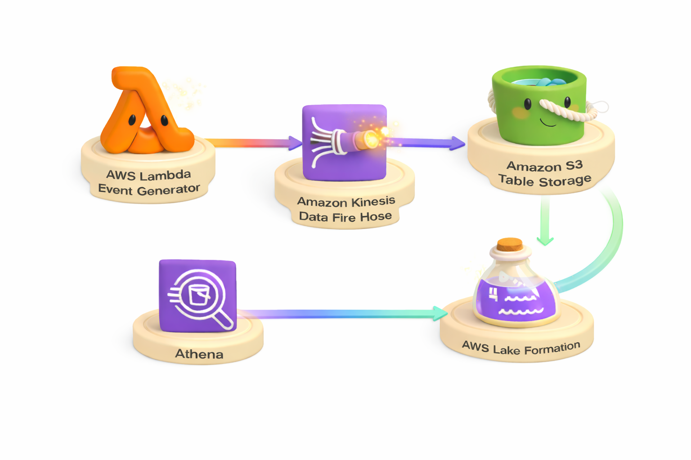
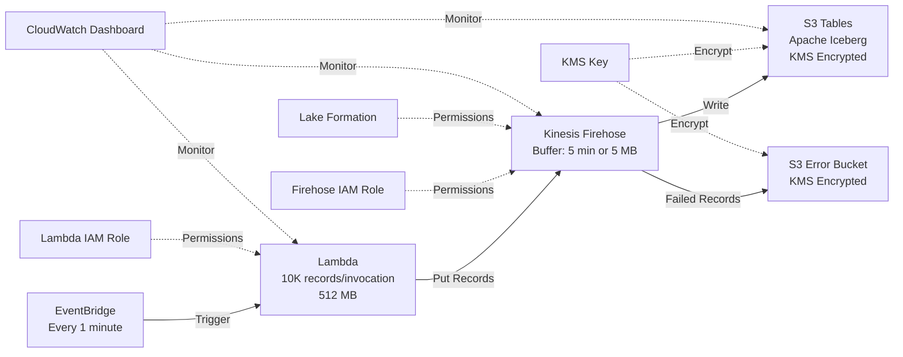
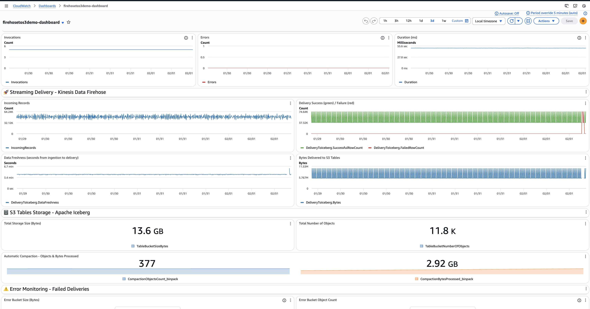

# Building a Serverless Real-Time Streaming Analytics Pipeline with Amazon S3 Tables and Kinesis Data Firehose

This solution demonstrates how to build a serverless real-time streaming analytics pipeline using Amazon Kinesis Data Firehose to deliver streaming data to Amazon S3 Tables. S3 Tables provides storage optimized for analytics workloads, with built-in Apache Iceberg support for efficient querying and automatic table maintenance.

## Solution Overview

This Terraform solution creates an end-to-end streaming analytics pipeline that generates IoT sensor data using AWS Lambda, simulating 10 sensors across multiple locations. The data streams continuously through Amazon Kinesis Data Firehose with automatic buffering and delivery, then gets stored in Apache Iceberg format using Amazon S3 Tables for optimized analytics performance. The solution integrates with AWS Lake Formation for centralized data governance and access control, enabling immediate querying with Amazon Athena for interactive analytics.

The solution generates approximately **600,000 records per hour** from simulated IoT sensors, demonstrating real-world streaming data patterns for temperature, humidity, and pressure monitoring across warehouse and office locations.

## Architecture



The following diagram illustrates the solution architecture:



**Key Components:**

The solution uses AWS services working together. **Amazon EventBridge** triggers the Lambda function every minute to generate sensor data. **AWS Lambda** (512 MB) generates 10,000 IoT sensor records per invocation at a rate of 200 records per second, using an **IAM role** with permissions to write to Firehose and CloudWatch Logs. **Amazon Kinesis Data Firehose** buffers incoming data for up to 5 minutes or 5 MB before writing to the destination, using an **IAM role** with permissions to access S3 Tables via Lake Formation, write to the error bucket, and use KMS for encryption. **Lake Formation** grants explicit permissions (ALL, ALTER, DELETE, DESCRIBE, DROP, INSERT, SELECT) to the Firehose role for database, table, and column access. **Amazon S3 Tables** stores data in Apache Iceberg format with automatic schema management and table optimization, encrypted with **AWS KMS** customer-managed keys. An **Amazon S3 error bucket**, also encrypted with **AWS KMS**, captures failed deliveries for monitoring and troubleshooting. **CloudWatch Dashboard** provides real-time monitoring of Firehose metrics, Lambda performance, and S3 Tables storage.

**Data Flow:**

Lambda generates sample IoT sensor data including sensor_id (unique identifier), timestamp (Unix timestamp in seconds), location (physical location), temperature (Celsius), humidity (percentage), and pressure (atmospheric pressure in hPa). The data generation rate is 200 records per second during Lambda execution, producing approximately 10,000 records per invocation and 600,000 records per hour across all sensors.

## CloudWatch Dashboard



The solution includes a comprehensive CloudWatch dashboard organized into four sections:

- **📥 Data Ingestion**: Lambda invocations, errors, and duration metrics
- **🚀 Streaming Delivery**: Firehose incoming records, delivery success/failure, data freshness, and bytes delivered
- **🗄️ S3 Tables Storage**: Total storage size, object count, and automatic compaction activity
- **⚠️ Error Monitoring**: Error bucket size and object count for failed deliveries

## Resources Created

- **S3 Tables**: Table bucket, namespace, and Iceberg table with schema (KMS encrypted)
- **Kinesis Firehose**: Delivery stream with Iceberg destination
- **S3 Bucket**: Error bucket for failed deliveries (KMS encrypted)
- **Lambda**: Data generator function (512 MB, triggered every minute)
- **EventBridge**: Schedule rule to trigger Lambda
- **IAM**: Roles and policies for Firehose and Lambda
- **KMS**: Customer-managed encryption key for S3 Tables and error bucket
- **CloudWatch Dashboard**: Real-time monitoring dashboard with 9 widgets
- **Lake Formation Permissions**: Automated grants via null_resource during deployment

## Prerequisites

### Required AWS Setup (One-time)

1. **S3 Tables Integration with Lake Formation** (Account-level setting)
   - Go to https://console.aws.amazon.com/s3/
   - Click **Table buckets** in the left navigation
   - Click **Enable integration** button
   - This registers S3 Tables with AWS Lake Formation

2. **Lake Formation Administrator Permissions**
   - The IAM identity running Terraform needs Lake Formation admin permissions
   - Go to https://console.aws.amazon.com/lakeformation/
   - Click **Administrative roles and tasks** → **Choose administrators**
   - Add your IAM user or role
   
   Or use AWS CLI:
   ```bash
   # Get your current identity
   aws sts get-caller-identity
   
   # Add as Lake Formation admin (replace with your ARN)
   aws lakeformation put-data-lake-settings \
     --data-lake-settings '{"DataLakeAdmins":[{"DataLakePrincipalIdentifier":"arn:aws:iam::ACCOUNT:user/YOUR_USER"}]}'
   ```

### Required Tools

- Terraform >= 1.0
- AWS CLI >= 2.15 (for S3 Tables support)
- AWS credentials configured
- Terraform AWS Provider >= 6.0 (for S3 Tables schema support)

### Validation Script

Run the validation script to check all prerequisites:

```bash
./validate-prerequisites.sh
```

This checks:
- AWS credentials configuration
- S3 Tables integration with Lake Formation
- Lake Formation administrator permissions
- Required IAM permissions
- AWS CLI version
- Terraform version

## Deployment Steps

### Step 0: Validate Prerequisites (Recommended)

Run the validation script to check all prerequisites:

```bash
./validate-prerequisites.sh
```

This script checks:
- AWS credentials are configured
- S3 Tables integration with Lake Formation is enabled
- Current IAM identity is a Lake Formation administrator
- Required IAM permissions are available
- AWS CLI version supports S3 Tables (v2.15+)
- Terraform is installed (v1.0+)

### Step 1: Enable S3 Tables Integration (One-time, Manual)

**IMPORTANT:** This must be done BEFORE deployment if not already enabled.

This is a one-time account-level setting:

1. Go to https://console.aws.amazon.com/s3/
2. Click **Table buckets** in the left navigation
3. Click **Enable integration** button
4. This registers S3 Tables with AWS Lake Formation

### Step 2: Grant Lake Formation Admin Permissions (One-time, Manual)

The IAM identity running Terraform needs Lake Formation administrator permissions.

1. Go to https://console.aws.amazon.com/lakeformation/
2. Click **Administrative roles and tasks**
3. Click **Choose administrators**
4. Add your IAM user or role
5. Click **Save**

Alternatively, use AWS CLI:
```bash
# Get your current identity
aws sts get-caller-identity

# Add as Lake Formation admin (replace with your ARN)
aws lakeformation put-data-lake-settings \
  --data-lake-settings '{"DataLakeAdmins":[{"DataLakePrincipalIdentifier":"arn:aws:iam::ACCOUNT:user/YOUR_USER"}]}'
```

**Note:** If using an assumed role (like EC2 instance role), use the base IAM role ARN, not the temporary session ARN.

### Step 3: Configure and Deploy

1. Edit `terraform.tfvars` and set `stack_name` (must be globally unique)

2. Deploy:
   ```bash
   terraform init
   terraform apply
   ```

All resources will be created with Lake Formation permissions automatically granted during the apply via `null_resource`.

### Step 4: Verify Data Flow

Lambda starts sending data immediately. Wait 5-6 minutes for Firehose buffering, then verify:

```bash
# Check Lambda logs
aws logs tail /aws/lambda/{stack_name}-data-generator --since 5m --region us-east-1

# Check Firehose metrics
aws cloudwatch get-metric-statistics \
  --namespace AWS/Firehose \
  --metric-name IncomingRecords \
  --dimensions Name=DeliveryStreamName,Value={stack_name} \
  --start-time $(date -u -d '10 minutes ago' +%Y-%m-%dT%H:%M:%S) \
  --end-time $(date -u +%Y-%m-%dT%H:%M:%S) \
  --period 60 \
  --statistics Sum \
  --region us-east-1

# Check for errors (should be empty)
aws s3 ls s3://{stack_name}-errors/errors/ --recursive
```

### Step 5: Access CloudWatch Dashboard

View the dashboard URL from Terraform outputs:

```bash
terraform output dashboard_url
```

The dashboard shows:
- Firehose incoming records and delivery success/failure
- Lambda invocations, errors, and duration
- S3 Tables storage size and file count

## Configuration Variables

| Variable | Description | Default | Example |
|----------|-------------|---------|---------|
| `stack_name` | Stack name for resource naming (required) | - | `firehosetos3demo` |
| `region` | AWS region | `us-east-1` | - |
| `enable_encryption` | Enable KMS encryption | `true` | - |

## Resource Naming Pattern

All resources use `stack_name`:
- Table bucket: `{stack_name}`
- Error bucket: `{stack_name}-errors`
- Firehose stream: `{stack_name}`
- Namespace: `{stack_name}`
- Table: `{stack_name}`
- Lambda: `{stack_name}-data-generator`

## Querying Data with Athena

After deployment, Lambda generates data every minute. Query with Athena:

### View All Sensor Data
```sql
SELECT * FROM firehosetos3demo.firehosetos3demo LIMIT 100;
```

### Average Temperature by Location
```sql
SELECT 
    location, 
    AVG(temperature) as avg_temp,
    COUNT(*) as reading_count
FROM firehosetos3demo.firehosetos3demo
GROUP BY location
ORDER BY avg_temp DESC;
```

### Recent High Temperature Alerts
```sql
SELECT 
    sensor_id, 
    temperature, 
    humidity,
    timestamp,
    from_unixtime(timestamp) as reading_time
FROM firehosetos3demo.firehosetos3demo
WHERE temperature > 25
ORDER BY timestamp DESC
LIMIT 50;
```

### Sensor Activity Summary
```sql
SELECT 
    sensor_id,
    location,
    COUNT(*) as total_readings,
    AVG(temperature) as avg_temp,
    AVG(humidity) as avg_humidity,
    MIN(timestamp) as first_reading,
    MAX(timestamp) as last_reading
FROM firehosetos3demo.firehosetos3demo
GROUP BY sensor_id, location
ORDER BY sensor_id;
```

**Note:** Replace `firehosetos3demo` with your `stack_name` in all queries.

## Module Structure

```
.
├── README.md
├── provider.tf                  # Terraform and provider configuration
├── variables.tf                 # Input variables
├── outputs.tf                   # Output values
├── terraform.tfvars             # Variable values
├── kms.tf                       # KMS key and alias
├── iam.tf                       # IAM roles and policies
├── s3.tf                        # S3 bucket and S3 Tables
├── firehose.tf                  # Lake Formation permissions and Firehose
├── lambda.tf                    # Lambda function and EventBridge
├── dashboard.tf                 # CloudWatch dashboard
├── validate-prerequisites.sh    # Prerequisites checker
└── lambda/
    └── data_generator.py        # Lambda function code
```

## Outputs

- `firehose_stream_name` - Firehose stream name
- `firehose_stream_arn` - Firehose stream ARN
- `table_bucket_name` - S3 table bucket name
- `table_bucket_arn` - S3 table bucket ARN
- `error_bucket_name` - Error bucket name
- `glue_database_name` - Glue database name
- `glue_table_name` - Table name
- `lambda_function_name` - Lambda data generator function name
- `kms_key_arn` - KMS key ARN
- `dashboard_name` - CloudWatch dashboard name
- `dashboard_url` - CloudWatch dashboard URL

## Monitoring

### CloudWatch Dashboard

Access the dashboard via the URL from Terraform outputs:

```bash
terraform output dashboard_url
```

The dashboard includes:
- **Firehose Metrics**: Incoming records, delivery success/failure, data freshness, bytes delivered
- **Lambda Metrics**: Invocations, errors, duration
- **S3 Tables Metrics**: Storage size, file count

### CloudWatch Logs

View Lambda execution logs:
```bash
aws logs tail /aws/lambda/{stack_name}-data-generator --follow
```

### Firehose Metrics

Monitor Firehose delivery in CloudWatch:
- `IncomingRecords` - Records received by Firehose
- `DeliveryToIceberg.SuccessfulRowCount` - Successfully delivered rows
- `DeliveryToIceberg.FailedRowCount` - Failed deliveries
- `DeliveryToIceberg.DataFreshness` - Time from arrival to delivery
- `DeliveryToIceberg.Bytes` - Bytes delivered

## Cleanup

```bash
terraform destroy
```

**Note:** KMS key will be scheduled for deletion in 7 days (AWS minimum).

## Troubleshooting

### Critical: Schema Definition Requirement

**Firehose requires S3 Tables to have a pre-defined schema.** Empty tables without schema will cause `Iceberg.NoSuchTable` errors.

**Solution:** Use Terraform AWS Provider >= 6.0 which supports the `metadata` block for schema definition. The table is automatically created with schema during `terraform apply`.

### Issue: Firehose errors with "Iceberg.NoSuchTable"

**Cause:** Table was created without schema, or Lake Formation permissions not granted.

**Solution:**
1. Verify table has schema:
   ```bash
   aws s3tables get-table \
     --table-bucket-arn arn:aws:s3tables:us-east-1:{account-id}:bucket/{stack_name} \
     --namespace {stack_name} \
     --name {stack_name} \
     --region us-east-1
   ```
2. Check if `metadata_location` exists in output
3. If missing, ensure you're using Terraform AWS Provider >= 6.0
4. Verify Lake Formation permissions were granted automatically (check Terraform output)

### Issue: "Insufficient Lake Formation permission(s)" during Terraform apply

**Cause:** The IAM identity running Terraform doesn't have Lake Formation administrator permissions.

**Solution:**
1. Get your current IAM identity:
   ```bash
   aws sts get-caller-identity
   ```
2. Add yourself as Lake Formation admin:
   ```bash
   aws lakeformation put-data-lake-settings \
     --data-lake-settings '{"DataLakeAdmins":[{"DataLakePrincipalIdentifier":"YOUR_ARN_FROM_STEP_1"}]}'
   ```
3. Re-run `terraform apply`

### Issue: Firehose errors with "Lakeformation.AccessDenied"

**Cause:** Lake Formation permissions not granted to Firehose role.

**Solution:**
The deployment should have granted these automatically via `null_resource`. If you see this error:
1. Check if you have Lake Formation administrator permissions
2. Manually grant permissions:
   ```bash
   # Get values from outputs
   ROLE_ARN=$(terraform output -raw firehose_stream_arn | sed 's/deliverystream.*/role\/firehosetos3demo-firehose-role/')
   ROLE_ARN="arn:aws:iam::$(aws sts get-caller-identity --query Account --output text):role/$(terraform output -raw firehose_stream_name)-firehose-role"
   BUCKET_ARN=$(terraform output -raw table_bucket_arn)
   ACCOUNT_ID=$(aws sts get-caller-identity --query Account --output text)
   STACK_NAME=$(terraform output -raw table_bucket_name)
   
   # Grant permissions
   aws lakeformation grant-permissions \
     --region us-east-1 \
     --principal DataLakePrincipalIdentifier=$ROLE_ARN \
     --resource "{\"DataLocation\":{\"ResourceArn\":\"$BUCKET_ARN\"}}" \
     --permissions DATA_LOCATION_ACCESS
   
   aws lakeformation grant-permissions \
     --region us-east-1 \
     --principal DataLakePrincipalIdentifier=$ROLE_ARN \
     --resource "{\"Table\":{\"CatalogId\":\"$ACCOUNT_ID:s3tablescatalog/$STACK_NAME\",\"DatabaseName\":\"$STACK_NAME\",\"Name\":\"$STACK_NAME\"}}" \
     --permissions SELECT INSERT DESCRIBE ALTER
   ```

### Issue: Athena query fails with "Catalog does not exist"

**Cause:** S3 Tables catalog not registered with Athena.

**Solution:**
1. Go to Athena console → Data sources → Create data source
2. Choose "S3 - AWS Glue Data Catalog"
3. Name: `s3tablescatalog_{stack_name}`
4. Catalog ID: `s3tablescatalog/{stack_name}`
5. Query using: `SELECT * FROM s3tablescatalog_{stack_name}.{stack_name}.{stack_name} LIMIT 10`

### Monitoring Data Flow

Check if data is flowing:
```bash
# View Lambda logs
aws logs tail /aws/lambda/{stack_name}-data-generator --follow

# Check Firehose incoming records
aws cloudwatch get-metric-statistics \
  --namespace AWS/Firehose \
  --metric-name IncomingRecords \
  --dimensions Name=DeliveryStreamName,Value={stack_name} \
  --start-time $(date -u -d '10 minutes ago' +%Y-%m-%dT%H:%M:%S) \
  --end-time $(date -u +%Y-%m-%dT%H:%M:%S) \
  --period 300 \
  --statistics Sum \
  --region us-east-1

# Check for delivery errors
aws s3 ls s3://{stack_name}-errors/errors/iceberg-failed/ --recursive
```

## Technical Notes

### Key Learnings from Implementation

1. **Schema Definition is Critical**: Firehose cannot write to S3 Tables without a pre-defined schema. The table must be created with the `metadata` block containing field definitions.

2. **Terraform Provider Version**: AWS Provider v6.0+ is required for schema support. Earlier versions (5.x) do not support the `metadata` block.

3. **Schema Definition Syntax**:
   ```hcl
   metadata {
     iceberg {
       schema {
         field {
           name     = "column_name"
           type     = "string"  # Iceberg types: string, long, double, timestamp, etc.
           required = false
         }
       }
     }
   }
   ```

4. **Lake Formation Permissions**: Firehose needs explicit Lake Formation permissions (SELECT, INSERT, DESCRIBE, ALTER) on both database and table, plus DATA_LOCATION_ACCESS on the table bucket. These are automatically granted by Terraform's `null_resource` during the apply.

5. **Single-Stack Deployment**: The solution uses a single Terraform stack with all resources defined in one main.tf file. Lake Formation permissions are granted via `null_resource` with `local-exec` provisioner between foundation resources and Firehose creation.

7. **Error Monitoring**: Check `s3://{stack_name}-errors/errors/iceberg-failed/` for delivery failures. Common errors:
   - `Iceberg.NoSuchTable`: Missing schema or table
   - `AccessDeniedException`: Missing Lake Formation permissions

### S3 Tables Schema Definition

As of January 2025, AWS added schema definition support to the CreateTable API. Terraform AWS Provider v6.0+ supports this via the `metadata` block:

```hcl
resource "aws_s3tables_table" "table" {
  name             = "table_name"
  namespace        = "namespace"
  table_bucket_arn = "arn:..."
  format           = "ICEBERG"

  metadata {
    iceberg {
      schema {
        field {
          name     = "column_name"
          type     = "string"  # or long, double, timestamp, etc.
          required = false
        }
      }
    }
  }
}
```

### Automated Lake Formation Permissions

Terraform's `aws_lakeformation_permissions` resource does not support S3 Tables catalog ARNs (format: `account:s3tablescatalog/bucket-name`). The solution uses a `null_resource` with `local-exec` provisioner that automatically grants Lake Formation permissions using AWS CLI during the Terraform apply. This requires the IAM identity running Terraform to have Lake Formation administrator permissions.

### Firehose Buffering

Firehose buffers data for up to 5 minutes (300 seconds) or 5 MB before writing to S3 Tables. This means there's a delay between Lambda sending data and it appearing in the table.
